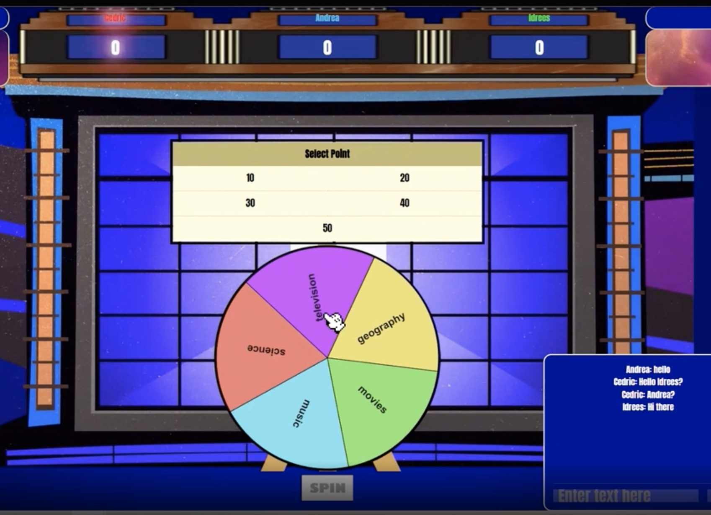
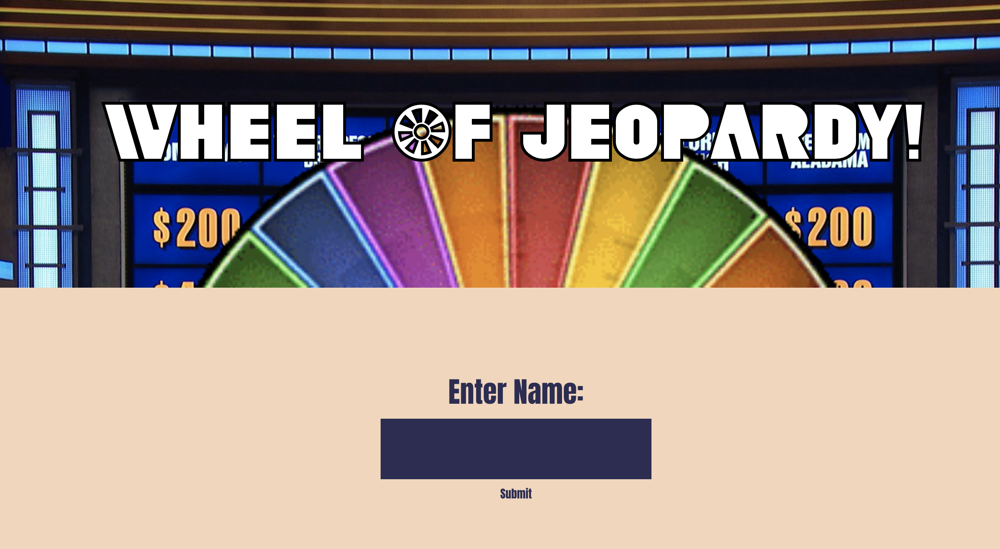

# The Wheel Of Jeopardy!
As part of our Foundations of Software Engineering Course, we have created a multiplayer video game “The Wheel of Jeopardy!”; a marriage of Wheel of Fortune and Jeopardy. 



# Setup: 
1. Install Node: __[NodeJS](https://nodejs.org/en/)__ 
2. Npm Dependencies:
  ```
    npm install socket.io
    npm install -g nodemon
    npm install --save express socket.io
    npm install --save mysql2
  ```
3. Install MySql __[Mysql](https://www.mysql.com/)__: 
4. Load Trivia Questions into MySQL Database using script __[load_questions.sql)](https://github.com/mj0-git/Wheel-Of-Jeopardy/blob/master/database/load_questions.sql)__:

# Run:   
Execute ``` nodemon server/server.js ``` and naviagte to ``` http://localhost:3000/ ``` in browser.

Homepage will display as shown below. 



__Note__, three players need to sign in in order to start a new game.

